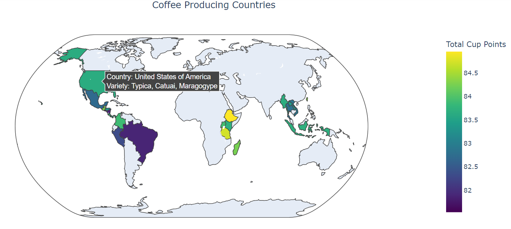
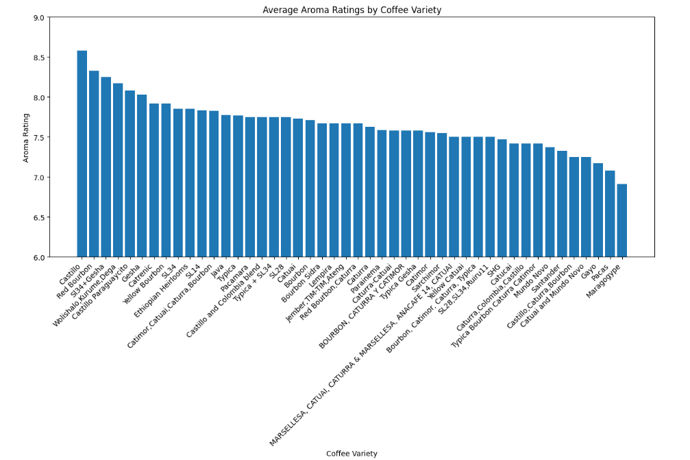
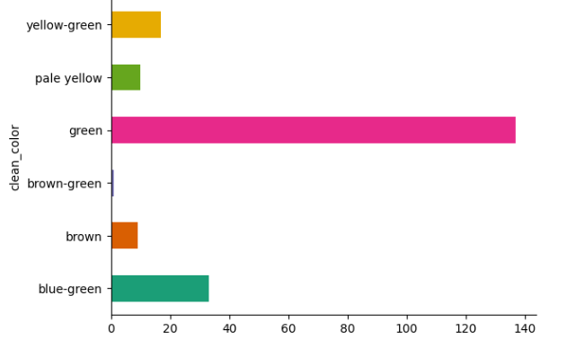
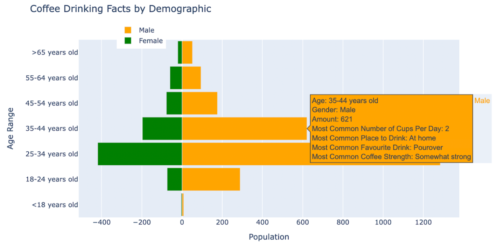
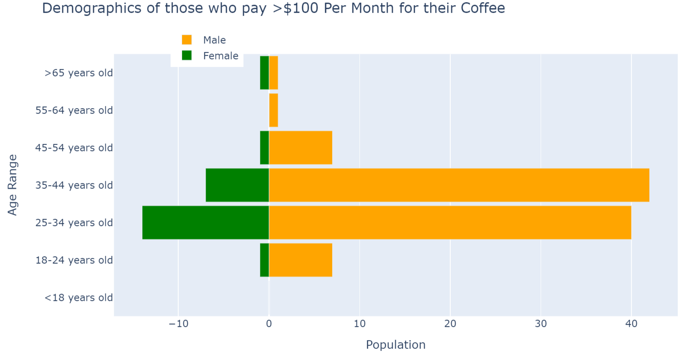
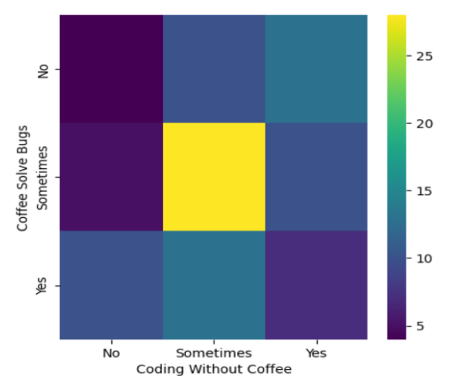
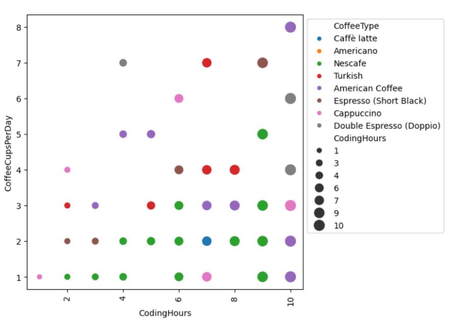
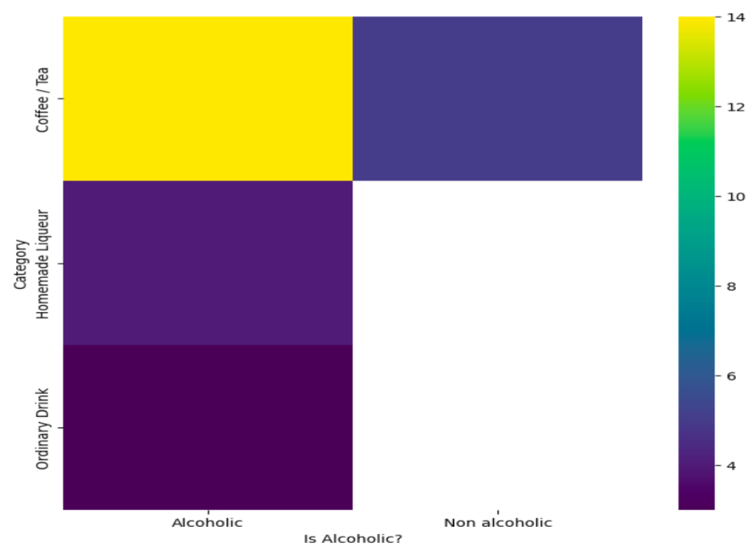
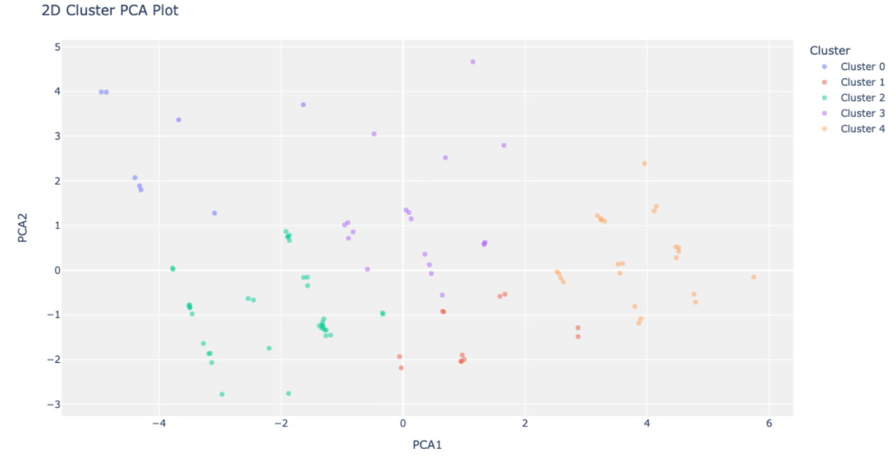
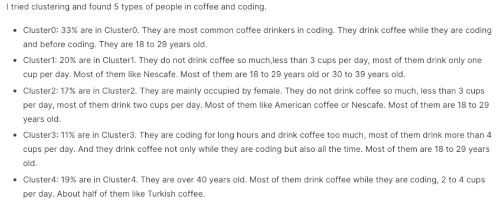

# Project of Data Visualization (COM-480)

| Student's name     | SCIPER  |
|--------------------|---------|
| Elif Kurtay        | 352311  |
| Nikhen Sanjaya Nyo | 376406  |
| Burcu Özer         | 355130  |

[Website](https://com-480-data-visualization.github.io/coffee_BEaN/)

[Milestone 1](documents/Milestone%201.pdf) • [Milestone 2](documents/Milestone%202.pdf) • [Milestone 3](#milestone-3)

## Milestone 1 (29th March, 5pm)

The full Milestone 1 document is shared in a PDF file which can be found [here](documents/Milestone%201.pdf).
The ReadMe version is missing images and tables.
### Dataset

For our project we decided to use four different datasets. All datasets are taken from Kaggle.
1. [Coffee Quality Data (CQI May-2023)](https://www.kaggle.com/datasets/fatihb/coffee-quality-data-cqi)
2. [Coffee Tastes & Survey data](https://www.kaggle.com/datasets/sujaykapadnis/lets-do-some-coffee-tasting)
3. [Coffee Coding and Data](https://www.kaggle.com/datasets/shrutikunapuli/coffee-and-code-dataset/data)
4. [Cocktail](https://www.kaggle.com/datasets/ai-first/cocktail-ingredients)

Coffee Quality Data (CQI May-2023): This dataset was obtained from the Coffee Quality Institute which aims to improve the quality of coffee worldwide. It is considered as a resource for coffee enthusiasts and professionals to increase their knowledge on coffee quality standards. The columns in the dataset include country of origin, coffee variety, color as well as sensory evaluations. These evaluations score the quality of coffee based on features like aroma and acidity. There is also a column for “total cup points” which considers all the features to give an overall score. Since the dataset was in a standardized format, it was easier to extract the necessary information for this project. The columns of the dataset and an example row is shown below:

| Country of Origin | Company             | Aroma | Variety | Acidity | Total Cup Points | Color |
|-------------------|---------------------|-------|---------|---------|------------------|-------|
| Colombia          | Coffee Quality Union| 8.58  | Castillo| 8.58    | 89.33            | green |

Coffee Tastes & Survey data: This dataset is again used to understand an insight for who is drinking coffee, why they are drinking coffee and what are their general preferences. This dataset was very big and had an interesting organization. Hence, some preprocessing was needed to extract what we wanted. At the end we were using columns such as: "Age", "Gender", "Amount","Most Common Number of Cups Per Day", "Most Common Place to Drink Coffee", "Most Common Favorite Coffee Drink", "Most Common Strength of Coffee".

Coffee Coding and Data: We realized that this dataset included some interesting coffee drinking habits of coders so we thought we could visualize it in a fun and interactive way. The dataset did not have many NaN values and most columns had categorical answers which made it easy to process. The columns of the dataset and an example row is shown below:

| CoffeeCupsPerDay | CoffeeTime      | CodingWithoutCoffee | CoffeeType  | CoffeeSolveBugs | Gender | Country | AgeRange |
|------------------|-----------------|---------------------|-------------|-----------------|--------|---------|----------|
| 2                | Before coding   | Yes                 | Caffè latte | Sometimes       | Female | Lebanon | 18 to 29 |

Cocktail: This dataset was again an interesting information that we came across. Many people are familiar with classic coffee drinks (latte, americano…) but not many people know of cocktails that can be formed with coffee. We thought that visualizing ingredient mixtures would be fun. However, it was not the easiest to extract only the coffee-related recipes. Therefore, we needed to do some data cleaning to achieve the following structure for our coffee cocktails:

| Drink_name | Is_alcoholic | Category    | Glass_type    | Ingredients                                              | Measures                                           | Instructions                                  | Image                                                  |
|------------|--------------|-------------|---------------|----------------------------------------------------------|----------------------------------------------------|-----------------------------------------------|--------------------------------------------------------|
| Afternoon  | Alcoholic    | Coffee / Tea| Collins Glass | [Kahlua, nan, nan, nan, nan, nan, nan, Bailey's Irish Cream, Milk] | [1 cl, \n, nan, nan, nan, nan, nan, 1 cl, 1 cl, \n, nan, nan, nan, nan, nan] | Build into a suiting glass, with no ice. Cream... | http://www.thecocktaildb.com/images/media/drin... |

### Problematic
As avid coffee drinkers, we are excited to delve into the diverse world of coffees globally, exploring the reasons behind its widespread popularity and its significance for programmers like ourselves. Our enthusiasm drives us to provide a platform for coffee enthusiasts to discover various information about coffee, assisting them in finding their ideal coffee variety based on their preferred tastes and aromas. Additionally, we aim to introduce coffee enthusiasts to innovative recipes which they can experiment with using their favorite coffee blends.

Our project revolves around showcasing the captivating journey of experiencing coffee. We will begin by highlighting the origins of different coffee types from around the world. Users will then have the opportunity to select their preferred tastes and aromas, allowing them to visualize the composition of various coffee blends based on their preferences.

Furthermore, we will provide insights into the primary motivations behind coffee consumption and the demographic characteristics of coffee drinkers. As an added feature, we will present unique visualizations depicting patterns in coffee preferences and habits among coders. Finally, our platform will offer a comprehensive guide on preparing coffee cocktails, featuring a multitude of recipe options for users to explore and enjoy.

We plan to include the following figures in our website:
- Figure 1: 	Visualize coffee varieties, their ratings and which country/city they come from, in a world map.
- Figure 2: 	Visualize the tastes of different types of coffee, in a star plot. Provide interactivity for users to adjust the tastes of the coffee they prefer on the graph, and get recommendations on which coffee they could have based on the tastes.
- Figure 3: 	Visualize the colors of different varieties of coffee.
- Figure 4: 	Visualize the reasons people drink coffee, in a pie chart.
- Figure 5: 	Visualize demographics of people who drink coffee with information on average cups of coffee per demographic, most common favorite drink, most common place to drink coffee, how strong they like their coffee, in a population pyramid. Includes interactivity, where users can select from a range of coffee drinking habit features, enabling the creation of a population pyramid tailored to their preferences.
- Figure 6: 	Visualize the common patterns which coders have in their coffee choice and habits, in a parallel coordinates graph.
- Figure 7: 	Provide interactive visualization that shows the composition of coffee based drinks (mainly cocktails) with their ingredients.

### Exploratory Data Analysis

All figures shown here are selected from the output of the data analysis done in the [Data Preparation notebook](data_analysis/DataPreparation.ipynb).

*Figure 1: Coffee varieties and total cup points of countries*

Using Coffee Quality Data (CQI May-2023), we extracted the countries producing coffee which are colored on the world map in Figure 1. From the colors, it can be concluded that the highest overall coffee quality is reached in the continent of Africa. The figure also shows the coffee varieties produced in a country when the country is hovered over.

*Figure 2: Average aroma ratings of each coffee variety*

In Figure 2, the plot shows that the majority of the varieties have a rating between 7 and 8. Notably, Castillo stands out with an exceptional aroma rating exceeding 8.5. We examined the frequencies of coffee colors in Figure 3 which shows that green is the most frequent coffee bean color which we were quite shocked that it was not brown.

*Figure 3: Frequency of coffee colors*

*Figure 4: Pie Chart On Reasons for Drinking Coffee*

From our Coffee Tastes & Survey data dataset, we found the distribution of reasons as to why people drink coffee, shown on Figure 4. We then plotted a population pyramid from the graph, where we obtained information about people’s coffee drinking habits, based on their demographic. From this data, we have found trends that indicate that the male population tends to drink more coffee than the female population, and prefers stronger coffee than the female population.

*Figure 5: Population Pyramid that shows Coffee drinking facts by demographic*

*Figure 6: Population Pyramid that shows the demographics of those who pay more than $100 per month for their coffee*

This visualization indicates that the predominant demographic among individuals who would pay >$100 per month for their coffee is males aged 35-44 years. The inclusion of these population pyramids aim to show graphs to the user in an interactive way, where the user could select different features from the dataset to create a pyramid on.

From our Coffee Coding and Data dataset, we found some interesting beliefs and habits of coders. In Figure 7, it can be observed that there is a decent number of people who believe coffee can solve bugs.

*Figure 7: Heatmap plot that shows whether coders who drink coffee believe that coffee solves bugs*

*Figure 8: Scatter plot that shows the preferences of coders: coding hours, coffee cups per day, and their preferred coffee type*

In Figure 8, we found the distribution of how much and when coders drink coffee depending on how many hours they code. It is common to see certain coffee types are consumed in similar amounts for people coding in similar hours. However, it is not so easy to say that there is a pattern.

From our Cocktail dataset, we showcased the categories of different drinks that can be made with coffee in Figure 9.

*Figure 9: Heatmap plot of number of coffee cocktails based on their drink category and whether they are alcoholic*

### Related work
- What have others already done with the data?
  - Coffee Quality Dataset: A data analysis was performed on [Kaggle](https://www.kaggle.com/code/onurtuncaybal/detailed-coffee-quality-data-analysis) to find the characteristics of each quality feature and the correlations between the sensory evaluation scores.
  - Coffee and Code Dataset: we saw that some people shared their [analysis](https://www.kaggle.com/code/sasakitetsuya/5-types-of-people-in-coffee-and-coding/notebook) of the same dataset on Kaggle where they clustered people’s preferences into 5 groups and analyzed the commonalities in each cluster. As seen in Figure 10, we believe we could use this new data as a possible fun addition to our website.
  - Coffee and Cocktail Dataset: The same dataset is used to create an [interactive website](https://app.bakamap.com/vizualisation/view/5f22db57786983092f7a23ce) with a dot map where one can select an ingredient to show all related other quantities.
- Why is your approach original?
  - The work done with the Coffee Quality dataset mostly focuses on the statistical analysis of the data rather than visualization. We will have a different approach that visualizes the coffee quality features using star plots to demonstrate them in a clearer and more interesting format.
  - The work done with the Coffee and Code dataset seems very interesting. We thought we could join the results of their analysis and use 5 colors per cluster in our parallel coordinate graph.
  - The work done with the Coffee and Cocktail dataset contains information about every kind of cocktail including the ones without coffee. We will extract the data on the cocktails with coffee and visualize it in a more informative and easy to interpret format. In addition, we found their map visualization confusing and not very useful and thus we will create a new visualization of complete cocktail recipes.
- What sources of inspiration do you take?
  - [Wine Project Visualization](https://github.com/com-480-data-visualization/com-480-project-onvagagner): We are taking inspiration from the way the project visualizes how our different senses are associated with the experience of wine, we would like to do the same for coffee.
  - [Past Coffee Visualization Project](https://github.com/com-480-data-visualization/project-2023-kingdom_of_kaffa): We thought there would be more interesting information shown both about coffee and coffee drinkers. On the other hand, we really like the coffee maker section and thought about doing a cocktail with coffees section instead which would be a less common knowledge.

*Figure 10: Scatter plot that shows the cluster of types of coders based on their coffee drinking habits and the explanation of each cluster*

## Milestone 2 (26th April, 5pm)

**10% of the final grade**
[Milestone 2](documents/Milestone%202.pdf)  PDF document is available in the folder documents.

## Milestone 3 (31st May, 5pm)

**80% of the final grade**

### Screencast and process book
[Screencast](documents/Screencast.mp4) and the PDF document for the [Process Book](documents/Process%20Book.pdf) are available in the 'documents' folder.

### Technical Setup
Requirements:
- Node.js
- yarn (npm install yarn)

In order to run the development version of the website:
- clone the repository, 
- go into the "website" folder 
- run `yarn install`
- run `yarn start`
The development server will start and the URL of the local website will be visible in the terminal.

In order to build the production version of the website: 
- clone the repository,
- go into the "website" folder
- run `yarn install`
- run `npm run build`

Production build of the website will be located in the website/build/ folder.
You can also check out the "gh-pages" branch for the build folder.

### Website
The website is hosted by GitHub Pages and is available [here](https://com-480-data-visualization.github.io/coffee_BEaN/).

### Data
The data used in the visualizations are available in the folder website/src/data.

## Late policy

- < 24h: 80% of the grade for the milestone
- < 48h: 70% of the grade for the milestone

